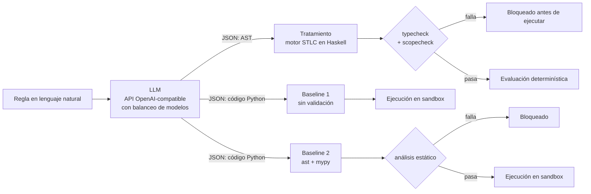

# llm-lambda-determinism-verifier

Pipeline que interpone una **capa de validación formal** entre un LLM y la ejecución de reglas de negocio, usando cálculo lambda simplemente tipado (STLC) implementado en Haskell.

La idea: un LLM es probabilístico y alucina. Si en lugar de pedirle código libre le pedimos un **AST serializado en JSON**, un verificador simbólico puede **comprobar tipos y alcance antes de ejecutar nada** y bloquear las construcciones inválidas. Este repositorio construye ese pipeline, junto con dos variantes de control que sirven de punto de comparación.

## Qué construye este repositorio

Tres componentes, más una UI que se agregó después del MVP:

| # | Componente | Lenguaje | Responsabilidad |
|---|---|---|---|
| 1 | **Motor de validación STLC** | Haskell | Deserializa el JSON al ADT del DSL, comprueba tipos y alcance de variables, y evalúa únicamente lo que pasó la verificación. |
| 2 | **Orquestador del pipeline** | Python | Pide la generación al LLM, la rutea al grupo correspondiente, invoca la validación, dispara la ejecución y registra el resultado de cada caso. |
| 3 | **Los dos baselines** | Python | Variantes de control sin validación formal, para poder contrastar el comportamiento del motor. |
| 4 | **UI** | TypeScript (React) + Python | Ejecuta desde el navegador las acciones del pipeline: corpus, corridas y registros ([`docs/ui.md`](docs/ui.md)). |

### Arquitectura



### Los tres grupos

- **Tratamiento** — el LLM emite un AST en JSON; el motor Haskell lo valida formalmente; solo entonces se evalúa.
- **Baseline 1 (control libre)** — el LLM emite un script Python que se ejecuta sin validación previa. Los errores estructurales se manifiestan recién en tiempo de ejecución.
- **Baseline 2 (control estructurado)** — el LLM emite Python que pasa por análisis estático del ecosistema (`ast` + `mypy`) antes de ejecutarse.

El Baseline 2 existe para que se pueda distinguir el efecto de "agregar validación estática" del efecto del enfoque funcional tipado. Sin los tres, el pipeline está incompleto.

Los tres grupos de un mismo caso usan el mismo modelo, y el LLM siempre responde en modo JSON (los baselines reciben el código como `{"code": "..."}`). El proveedor se elige por configuración; ver [`docs/llm-client.md`](docs/llm-client.md).

### El DSL

Un cálculo lambda simplemente tipado, mínimo y cerrado al dominio de reglas de negocio:

```
Tipos        τ ::= Int | Decimal | Bool | String | τ → τ
Expresiones  e ::= Literal | Var | UnaryOp | BinaryOp | In | IfThenElse | Lam | App
```

Los constructores del ADT son la frontera: lo que no se puede escribir en el DSL, el LLM no lo puede producir. Incluye aritmética exacta con `Decimal`, `NOT`, `!=` e `IN`; ver [`docs/dsl-extension.md`](docs/dsl-extension.md).

## Alcance

Este repositorio es **solo para construir el pipeline**: un MVP de laboratorio, pensado para armarse en aproximadamente una semana entre 3 desarrolladores en paralelo (ver [`specs/roadmap.md`](specs/roadmap.md)). No ejecuta experimentos, no recolecta datos, no calcula métricas, no produce análisis ni informes. Esas actividades son posteriores y viven fuera de acá. La UI permite lanzar corridas, mirar sus registros y ver un resumen de cada corrida (`pass@1` por grupo, desenlaces, duración y errores), calculado en el navegador; el análisis del experimento sigue siendo aparte.

Está terminado cuando alguien puede clonar el repositorio, configurar credenciales de un LLM en `.env` y correr `docker compose up --build` para obtener el pipeline corriendo sobre los tres grupos — sin escribir código adicional.

## Stack

- **Haskell** (GHC ≥ 9.4, GHC2021) + Cabal — motor de validación (`engine/`). `aeson` para deserializar, `hspec` + `QuickCheck` para tests.
- **Python** 3.12+ — orquestador y baselines (`pipeline/`). `mypy --strict`, `pytest`.
- **LLM** — cualquier API OpenAI-compatible, configurada en `pipeline/llm.toml`, con balanceo entre modelos según su cuota. Para el experimento: modelos gratuitos de Groq.
- **Docker Compose** — entorno de laboratorio: un servicio por componente, sin instalar toolchains localmente.

## Estructura del repositorio

```
├── README.md              # este archivo
├── AGENTS.md              # reglas mínimas de trabajo (humanos y agentes de IA)
├── specs/                 # misión, stack, roadmap y estado actual vs. la guía de entrega
├── docs/                  # decisiones de arquitectura para humanos, un .md por asunto
├── contracts/             # JSON Schema compartido entre engine/ y pipeline/ (acordar Día 0)
├── engine/                # C-1: motor de validación STLC (Haskell)
├── pipeline/              # C-2 orquestador + C-3 baselines (Python)
├── corpus/                # reglas del experimento, una por archivo (docs/corpus.md)
├── ui/                    # C-4: SPA React + Vite + Tailwind (docs/ui.md)
├── prototype/             # mockup de referencia, NO normativo (ver aviso en el archivo)
├── Dockerfile             # imagen única, una etapa por componente (ver docs/docker.md)
└── docker-compose.yml     # entorno de laboratorio
```

## Cómo empezar

```powershell
# Copiar credenciales del LLM (no commitear .env) y completar GROQ_API_KEY
# (u otras claves, si cambiás de proveedor en pipeline/llm.toml)
Copy-Item .env.example .env

# Build, gates de los dos componentes y corrida de punta a punta sobre las fixtures
docker compose up --build
```

`docker compose up --build` levanta cinco servicios:

| Servicio | Qué hace | Termina solo |
|---|---|---|
| `engine` | `cabal test` del motor Haskell | sí |
| `pipeline` | `mypy` + `pytest` del orquestador y los baselines | sí |
| `sandbox` | ejecuta el código de los baselines, sin red ([`docs/sandbox.md`](docs/sandbox.md)) | no: cortar con Ctrl+C o `docker compose down` |
| `run` | corre los tres grupos sobre [`contracts/fixtures/`](contracts/fixtures/) con el LLM real y escribe `out/<run_id>.jsonl` | sí |
| `ui` | la UI en http://localhost:8000, solo accesible desde esta máquina ([`docs/ui.md`](docs/ui.md)) | no: cortar con Ctrl+C o `docker compose down` |

`run` llama al LLM y **consume cuota** (15 casos × 3 grupos = 45 llamadas). Si `.env` no tiene credenciales, avisa y termina sin error, así `up` sigue sirviendo para correr los gates.

```powershell
# Iterar sobre un solo componente
docker compose run --rm engine cabal test
docker compose run --rm pipeline sh -c "mypy . && pytest"

# Corrida de punta a punta con opciones (casos, repeticiones, destino)
docker compose run --rm run python -m pipeline run --repetitions 3
docker compose run --rm run python -m pipeline run --help

# Corpus del experimento (carpeta corpus/): verificar las reglas,
# completar expected con el engine y correrlas
docker compose run --rm pipeline python -m pipeline check-case /workspace/corpus --write
docker compose run --rm run python -m pipeline run /workspace/corpus --repetitions 3

# Solo la UI (y el sandbox que necesita): http://localhost:8000
docker compose up --build ui

# Apagar el sandbox y la UI
docker compose down
```

Cada renglón del JSONL es un escenario de una generación ([`contracts/output-record-schema.json`](contracts/output-record-schema.json)). El análisis a partir de ahí es trabajo del experimento; la UI solo muestra un resumen por corrida. Cómo armar el corpus: [`docs/corpus.md`](docs/corpus.md).

No hace falta instalar GHC ni Python localmente: todo corre dentro de los contenedores. Ver [`specs/roadmap.md`](specs/roadmap.md) para el plan día a día.

## Aprender programación funcional con este repositorio

El motor también sirve como material de aprendizaje: [`docs/guia-conceptos-fp.md`](docs/guia-conceptos-fp.md) indica dónde se aplica cada concepto del curso (tipos, patrones, recursión, clases, etc.) y cómo encontrarlo con `git grep -nF "FP[<concepto>]"`.

## Contexto académico

El diseño del pipeline se basa en el trabajo *"Mitigación de incertidumbre probabilística en LLM aplicados a procesos determinísticos mediante cálculo lambda"* (Avila, Samaniego, Smulever — UNNE, Doctorado en Informática). Este repositorio implementa el modelo computacional ahí descrito; la investigación en sí no forma parte de él.
