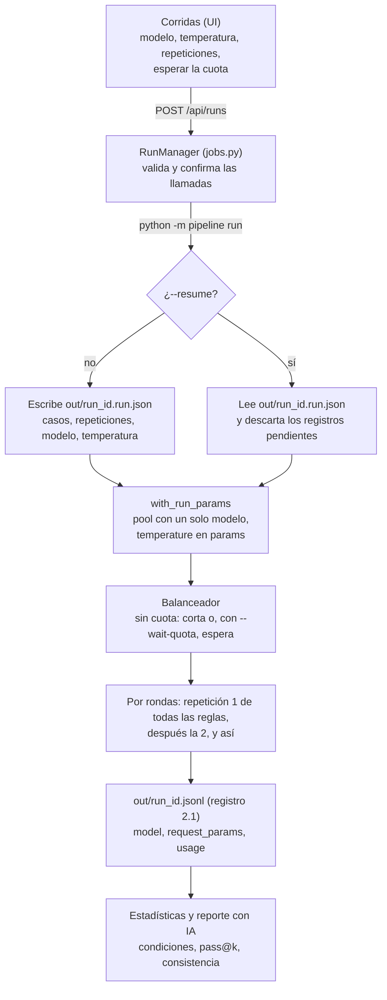

# Condiciones de corrida: modelo, temperatura, repeticiones y cuota

Qué fija una corrida del experimento y cómo sobrevive a la cuota del proveedor. El comportamiento normativo está en [`specs/orquestador.md`](../specs/orquestador.md) (CLI) y [`specs/ui.md`](../specs/ui.md) (API y pantallas). El registro de salida, en [`contracts/README.md`](../contracts/README.md) §3.

## Por qué

Una corrida preliminar mostró cuatro problemas de diseño: una sola repetición, temperatura sin fijar ni registrar, modelos repartidos según la cuota (y por eso confundidos con la categoría) y corridas cortadas a mitad por la cuota diaria de Groq Free. Para comparar los grupos hacen falta corridas con un solo modelo, una temperatura conocida y varias repeticiones, y que puedan durar varios días de cuota sin mezclar condiciones.

## Flujo

## Decisiones

- **Un modelo fijo por corrida.** `--model` deja en el pool solo ese modelo. Sin otro adonde ir, el balanceador no puede cambiar de modelo a mitad de corrida, y la categoría deja de mezclarse con el modelo. "Automático" sigue existiendo, con un aviso, para pruebas que no son el experimento.
- **Temperatura fija y registrada.** La UI la envía siempre (0 por defecto). Queda en `request_params` de cada renglón, junto con los tokens de `usage`, desde el registro 2.1. Un renglón 2.0 se muestra como "no registrada".
- **Rondas en vez de casos.** Si la cuota corta la corrida, lo hecho queda parejo entre reglas: todas con la repetición 1, en vez de unas completas y otras sin empezar.
- **Pendiente no es falla.** Un `llm_error` por `quota_exhausted` o `transport_error` es infraestructura, no del modelo. No entra en `pass@1` ni en `pass@k`, y al reanudar se reintenta. `generation_failed` (JSON inválido) sí es del modelo y cuenta.
- **Reanudar con las mismas condiciones.** Cada corrida nueva guarda sus condiciones en `out/<run_id>.run.json`. `--resume` las toma de ahí y rechaza cualquier valor distinto, para no mezclar temperaturas o modelos en una misma corrida. Las corridas anteriores a ese archivo se reanudan sin modelo ni temperatura, como se lanzaron.
- **Esperar la cuota es opcional.** Con `--wait-quota` la corrida espera lo que pida el proveedor, aunque sean horas, en vez de cortarse. Sirve para dejar una corrida larga desatendida. Viene desactivado porque deja un proceso vivo mucho tiempo, y se puede cancelar desde la UI.
- **Estimación antes de lanzar.** La UI muestra las llamadas pendientes y, si hay una corrida previa con `usage`, una estimación de tokens. Con un solo modelo en Groq Free (200K tokens diarios), 90 reglas × 3 grupos × 5 repeticiones son unas 1.350 llamadas: varios días de cuota.

## Qué mira después la UI

- **Estadísticas:** condiciones de la corrida, con avisos si hay varios modelos, temperatura mixta o sin fijar, o una sola repetición; `pass@k` y reglas inestables entre repeticiones; dónde se detecta cada falla (motor, ejecución o escenarios); filtro de reglas con la revisión aprobada.
- **Reporte con IA:** recibe esas mismas cifras como evidencia, así sus limitaciones salen de los datos de la corrida y no de un texto fijo.
