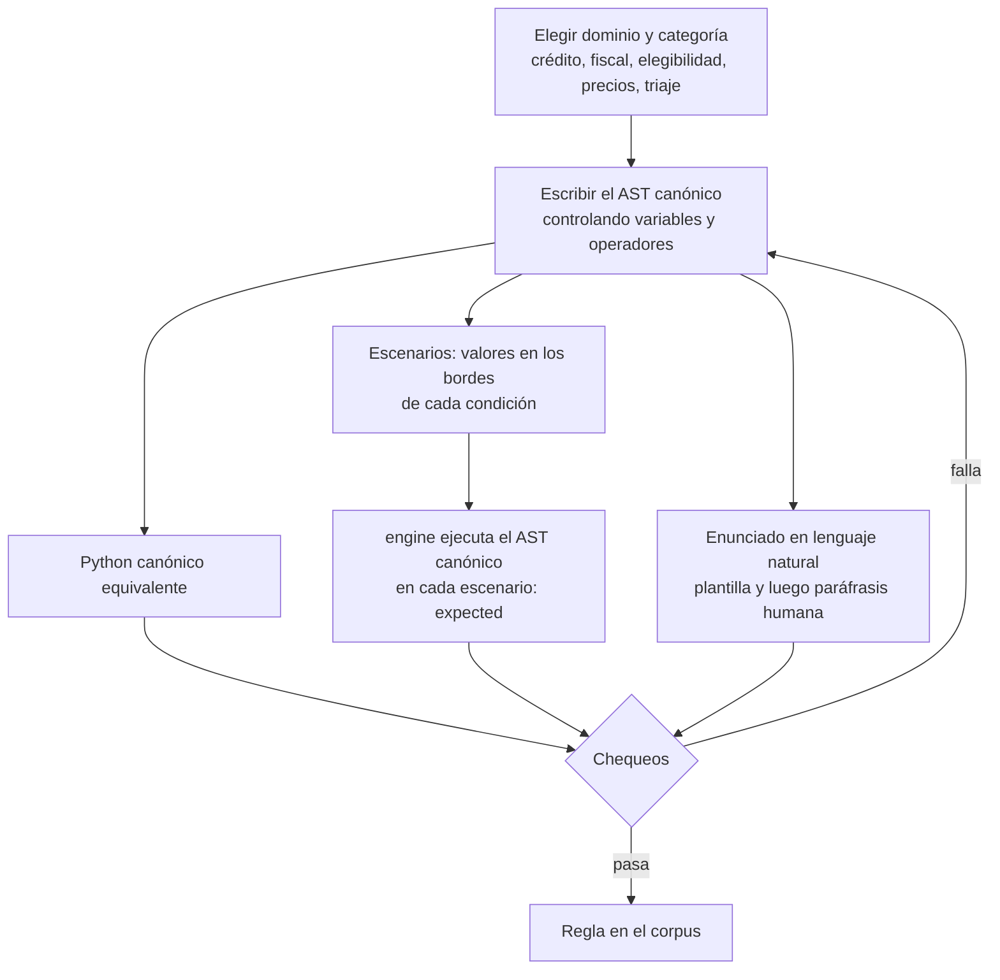

# Corpus del experimento

Cómo se construye el conjunto de reglas de negocio con el que se corre el experimento. El corpus **no es un entregable del MVP** (`specs/mission.md` §2), pero el MVP tiene que poder consumirlo. Lo que cada referencia aporta está en [`antecedentes.md`](antecedentes.md). Esta versión reemplaza a [`prototype/guia_construccion_corpus.md`](../prototype/guia_construccion_corpus.md).

## Lo que fija la propuesta aprobada

La sección 8 del proyecto, validada por la cátedra, establece:

- Las **peticiones** de reglas de negocio se clasifican en tres categorías de prueba, adaptadas de λRepair [18]: (1) errores sintácticos, (2) errores de tipado y (3) inconsistencias lógicas de ejecución.
- Las reglas y **sus escenarios de validación** se estructuran en JSON inspirado en las pruebas de decisión DMN [2].
- La precisión se mide con **`pass@1`** [10]. Las alucinaciones que respetan los tipos pero invierten la lógica no las ataja el validador: se miden con `pass@1`.
- En los tres grupos se registran:
  - errores sintácticos o estructurales;
  - errores detectados por el validador;
  - errores en ejecución;
  - ejecuciones exitosas;
  - opcionalmente, el tiempo.

## Las tres categorías de prueba

λRepair clasifica programas con errores **reales** que el LLM debe reparar. Acá el LLM **genera** desde lenguaje natural, así que la categoría indica **qué falla está diseñada para provocar la petición**, no qué error ocurrió. Lo que efectivamente pasa se registra aparte (`outcome`, `stage`), y el análisis cruza lo buscado con lo observado. Las tres categorías llevan la misma cantidad de reglas, como los 50/50/50 de λRepair.

| Categoría | La petición está diseñada para provocar... | Ejemplos de diseño | Dónde lo intercepta el Tratamiento |
|---|---|---|---|
| 1. Sintácticos / estructurales | Estructuras largas o profundas | muchas condiciones encadenadas, `IF` anidados, listas largas en `IN`, reglas de más de 100 palabras | `parse` (`MALFORMED_JSON`, `INVALID_AST`) |
| 2. Tipado y alcance | Mezclar tipos o nombrar datos que no existen | comparar un texto con un número ("nivel alto"), un campo que el enunciado nombra pero no está en Γ, ramas que devuelven un monto o un mensaje (`BRANCH_MISMATCH`), `%` sobre decimales | `scope` / `typecheck` |
| 3. Inconsistencias lógicas de ejecución | Invertir la lógica sin romper los tipos | límites `>` contra `>=`, negaciones y excepciones ("salvo que..."), precedencia entre `AND` y `OR`, porcentajes, divisiones con divisor que puede ser cero | no las bloquea: `pass@1` contra los escenarios, y `runtime_error` si fallan al ejecutar |

La guía original ubicaba `BRANCH_MISMATCH` en la categoría 3. Para el engine es un error de tipos, así que pertenece a la 2.

## Formato de una regla

Extiende las fixtures de [`contracts/fixtures/`](../contracts/fixtures/) con la categoría y varios escenarios, al estilo de las pruebas DMN:

```json
{
  "case_id": "RULE-042",
  "category": 3,
  "domain": "credito",
  "description": "Aprobar el préstamo si la cuota no supera el 30 % del ingreso mensual y el cliente no tiene morosidades.",
  "gamma": { "cuota": "Decimal", "ingreso_mensual": "Int", "tiene_morosidades": "Bool" },
  "canonical_ast": { "expr": { "...": "AST del DSL" } },
  "canonical_python": "def evaluate_rule(data): ...",
  "scenarios": [
    { "scenario_id": "S1", "env": { "cuota": 1500.5, "ingreso_mensual": 5000, "tiene_morosidades": false }, "expected": { "type": "Bool", "value": false } },
    { "scenario_id": "S2", "env": { "cuota": 1499.5, "ingreso_mensual": 5000, "tiene_morosidades": false }, "expected": { "type": "Bool", "value": true } }
  ]
}
```

- **`expected` lo calcula el engine** al ejecutar `canonical_ast` en cada escenario. Así el resultado esperado sale de una semántica decidible, sin etiquetado humano (el criterio de Cuconato [4]).
- **`gamma` tiene que ser el mismo en todos los escenarios de la regla.** El engine deduce Γ del valor (un número entero es `Int`), así que un campo `Decimal` tiene que llevar valores no enteros en todos los escenarios.

## Cómo se construye



**Dominio e inspiración.** Las reglas son propias, escritas en la línea de:
- las descripciones de Goossens (IMC, licencia, vacaciones, beca);
- los desafíos de la Decision Management Community (préstamos, tarjetas, impuestos, seguros);
- los topes fiscales de Veeramani.

No se copia texto de esas fuentes: sus términos no autorizan el reuso. Escribir reglas nuevas también reduce el riesgo de que los modelos las hayan visto al entrenarse, una amenaza que Zhang [18] declara para sus propios datos.

**De la especificación al texto** (LTLBench [15], BLInD [11]). Primero se escribe el AST y después el enunciado. Así cada regla tiene una semántica exacta, y la complejidad se controla por separado:
- cantidad de variables: de 1 a 5;
- cantidad de operadores: de 1 a 8;
- presencia de `IF`, `Lam` e `IN`.

**Escenarios en los bordes.** Por cada comparación, un valor justo en el umbral y uno a cada lado; por cada `AND` u `OR`, combinaciones que hagan decidir a cada operando. Esto es lo que distingue `>` de `>=` en la categoría 3.

**Chequeos antes de aceptar una regla:**
- `expected` cubre los dos resultados posibles, y en las reglas booleanas está **balanceado 50/50** (Tang [15]). Esto además descarta tautologías, sin necesidad de Z3;
- el Python canónico da los mismos `expected` que el engine;
- Γ es el mismo en todos los escenarios;
- el enunciado no es ambiguo: dos personas escribirían el mismo AST. Una regla ambigua va a un grupo aparte, fuera de `pass@1`.

## Tamaño y protocolo sugeridos

Los antecedentes usan conjuntos chicos y curados:
- Goossens: 6 descripciones;
- Veeramani: 20 escenarios;
- λRepair: 50 por categoría;
- Tang: 200 ítems para evaluar.

Una base razonable:
- **30 reglas por categoría** (90 en total), repartidas en 4 o 5 dominios;
- **8 escenarios por regla**;
- **3 a 5 repeticiones** por regla y grupo: Goossens usa 3, Zhang usa 5 y Mündler, 4 *seeds*.

La temperatura se fija y se registra. Cherednichenko usa entre 0 y 0,3 para código; Goossens compara entre 0 y 1. Las métricas se fijan antes de correr el experimento (Cuconato [4]).

## Cómo lo consume el pipeline

El formato de entrada es [`contracts/case-schema.json`](../contracts/case-schema.json) (§5 de `contracts/README.md`). El pipeline lee `case_id`, `description` y los `scenario_id` y `env` de cada escenario; el resto es del corpus.

1. **Una generación contra N escenarios.** La misma respuesta del LLM se ejecuta contra el `env` de cada escenario y deja un registro por escenario con su `scenario_id` (registro versión `2.0`).
2. **Repeticiones.** Cada ronda de triple llamada se numera en `repetition`; cuántas se hacen es configuración de la corrida.
3. **Categoría.** No va en el registro: se une con el corpus por `case_id`.
4. **Validaciones del corpus.** Antes de llamar al LLM, el orquestador exige `scenario_id` únicos y el mismo Γ en todos los escenarios; si no, aborta la corrida.

Calcular `pass@1` y las demás métricas es trabajo del experimento, no del pipeline. El pipeline solo registra.

## Correcciones a la guía original

| La guía decía | Qué dicen las fuentes |
|---|---|
| Las categorías clasifican casos por su error | En λRepair son programas reparados; acá, la falla que busca provocar la petición |
| `BRANCH_MISMATCH` es categoría 3 | Es error de tipos: categoría 2 |
| Usar GSM8K, MATH-500, FormalStep, NL4Opt como fuente | Son matemática u optimización; no se pueden expresar como reglas de negocio |
| HaluEval, FELM | Miden factualidad en preguntas y respuestas; no aplican |
| Auditar con Z3, Lean y Neo4j | El engine calcula `expected` sobre el AST canónico; el balance de escenarios descarta tautologías |
| El balance 50/50 viene de MindGames y ToMBench | Tang lo usa con MindGames y LTLBench; en ToMBench no se encontró |
