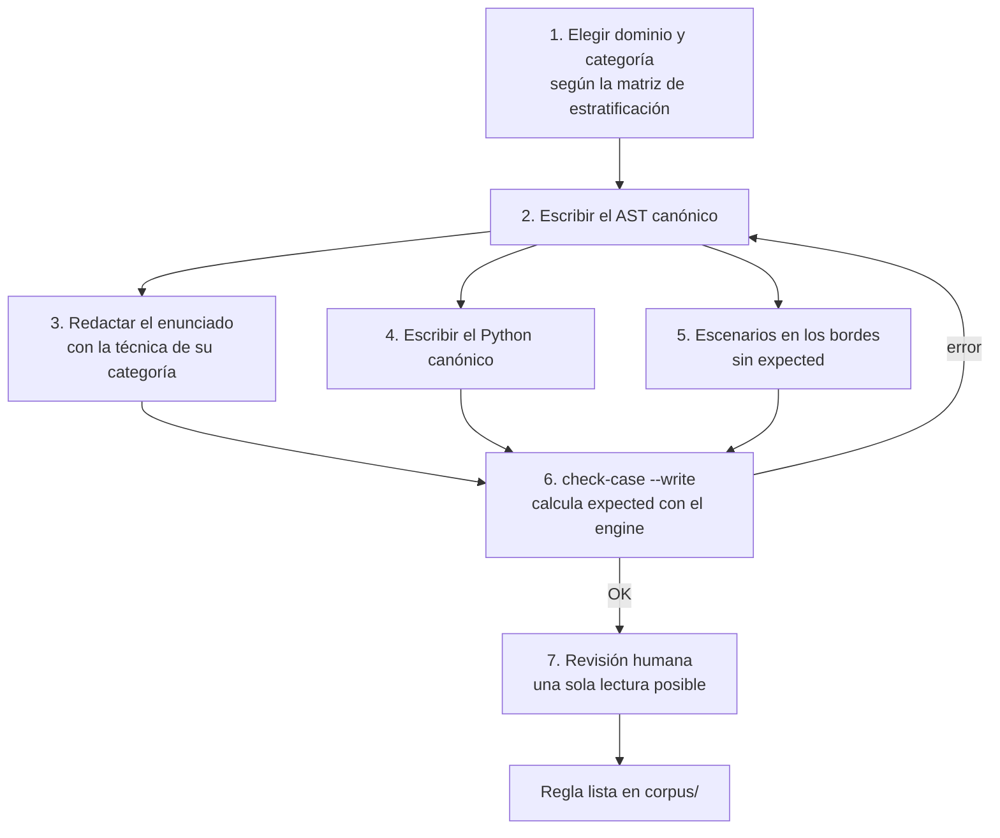

# Guía para construir el corpus del experimento

Cómo armar, verificar y correr el conjunto de reglas de negocio del experimento. El corpus **no es un entregable del MVP** (`specs/mission.md` §2), pero el MVP lo consume y trae una herramienta para verificarlo. Lo que aporta cada referencia está en [`antecedentes.md`](antecedentes.md). Esta guía reemplaza a [`prototype/guia_construccion_corpus.md`](../prototype/guia_construccion_corpus.md).

## Lo que fija la propuesta aprobada

La sección 8 del proyecto, validada por la cátedra, establece:

- Las **peticiones** de reglas de negocio se clasifican en tres categorías de prueba, adaptadas de λRepair [18]: (1) errores sintácticos, (2) errores de tipado y (3) inconsistencias lógicas de ejecución.
- Las reglas y **sus escenarios de validación** se estructuran en JSON inspirado en las pruebas de decisión DMN [2].
- La precisión se mide con **`pass@1`** [10]. Las alucinaciones que respetan los tipos pero invierten la lógica no las ataja el validador: se miden con `pass@1`.
- En los tres grupos se registran:
  - errores sintácticos o estructurales;
  - errores detectados por el validador;
  - errores en ejecución;
  - ejecuciones exitosas;
  - opcionalmente, el tiempo.

## Dónde vive

- **Una regla por archivo JSON**, en la carpeta `corpus/` de la raíz del repo. Está en `.gitignore`: el corpus no se versiona acá. Los contenedores la ven en `/workspace/corpus`.
- **Ejemplos:** hay tres reglas terminadas, una por categoría, en [`pipeline/tests/data/corpus/`](../pipeline/tests/data/corpus/). Los tests verifican que sigan siendo válidas, así que sirven de plantilla:
  - [`ejemplo-cat1-riesgo.json`](../pipeline/tests/data/corpus/ejemplo-cat1-riesgo.json)
  - [`ejemplo-cat2-beneficio.json`](../pipeline/tests/data/corpus/ejemplo-cat2-beneficio.json)
  - [`ejemplo-cat3-cuota.json`](../pipeline/tests/data/corpus/ejemplo-cat3-cuota.json)

## Formato de una regla

Extiende el caso de entrada del pipeline ([`contracts/case-schema.json`](../contracts/case-schema.json)) con los campos del corpus:

| Campo | Contenido | Lo usa |
|---|---|---|
| `case_id` | identificador único en todo el corpus | pipeline y experimento |
| `category` | `1`, `2` o `3` (ver abajo) | experimento |
| `domain` | `credito`, `fiscal`, `elegibilidad`, `precios`, `triaje`… | experimento (estratificación) |
| `description` | la regla en lenguaje natural: **lo único que ve el LLM** | pipeline |
| `gamma` | `{variable: tipo}`, igual al que deduce el engine | verificación |
| `canonical_ast` | la regla correcta en el DSL: `{"expr": ...}` ([contracts §1](../contracts/README.md)) | verificación y `expected` |
| `canonical_python` | la regla correcta como `evaluate_rule(data)` | verificación |
| `scenarios[]` | `{scenario_id, env, expected}` | pipeline (`env`) y experimento (`expected`) |

```json
{
  "case_id": "EJ-CAT3-CUOTA",
  "category": 3,
  "domain": "credito",
  "description": "Aprobar el préstamo si la cuota mensual no supera el 30 % del ingreso mensual, salvo que el cliente tenga morosidades.",
  "gamma": { "cuota": "Decimal", "ingreso": "Int", "tiene_morosidades": "Bool" },
  "canonical_ast": { "expr": { "type": "BinaryOp", "op": "AND", "left": { "...": "cuota <= ingreso * 0.30" }, "right": { "...": "NOT tiene_morosidades" } } },
  "canonical_python": "from decimal import Decimal\n\ndef evaluate_rule(data):\n    return data['cuota'] <= data['ingreso'] * Decimal('0.30') and not data['tiene_morosidades']\n",
  "scenarios": [
    { "scenario_id": "S1", "env": { "cuota": 1500.5, "ingreso": 5000, "tiene_morosidades": false }, "expected": { "type": "Bool", "value": false } },
    { "scenario_id": "S2", "env": { "cuota": 1499.5, "ingreso": 5000, "tiene_morosidades": false }, "expected": { "type": "Bool", "value": true } }
  ]
}
```

## Las tres categorías de prueba

λRepair clasifica programas con errores **reales** que el LLM debe reparar. Acá el LLM **genera** desde lenguaje natural, así que la categoría indica **qué falla está diseñada para provocar la petición**, no qué error ocurrió. Lo que efectivamente pasa se registra aparte (`outcome`, `stage`), y el análisis cruza lo buscado con lo observado. Las tres categorías llevan la misma cantidad de reglas, como los 50/50/50 de λRepair.

| Categoría | La petición está diseñada para provocar... | Técnicas de redacción | Dónde lo intercepta el Tratamiento |
|---|---|---|---|
| 1. Sintácticos / estructurales | Estructuras largas o profundas | muchas condiciones encadenadas, `IF` anidados (ver `ejemplo-cat1-riesgo`), listas largas en `IN`, reglas de más de 100 palabras | `parse` (`MALFORMED_JSON`, `INVALID_AST`) |
| 2. Tipado y alcance | Mezclar tipos o nombrar datos que no existen | nombrar un dato que no está en Γ (`ejemplo-cat2-beneficio` menciona el "nivel de riesgo"), comparar texto con número, ramas que devuelven un monto o un mensaje, `%` sobre decimales | `scope` / `typecheck` |
| 3. Inconsistencias lógicas de ejecución | Invertir la lógica sin romper los tipos | límites `>` contra `>=`, negaciones y excepciones ("salvo que...", ver `ejemplo-cat3-cuota`), precedencia entre `AND` y `OR`, porcentajes, divisiones con divisor que puede ser cero | no las bloquea: `pass@1` contra los escenarios, y `runtime_error` si fallan al ejecutar |

En todas las categorías, la regla tiene que tener **una única interpretación correcta**: el `canonical_ast` es esa interpretación. La tentación está en *cómo* se pide, no en que la regla sea ambigua. `BRANCH_MISMATCH` es un error de tipos para el engine, así que pertenece a la categoría 2, no a la 3 como decía la guía original.

## Paso a paso



1. **Dominio y categoría.** Elegí la celda de la matriz de estratificación que falta completar. Inspirate en dominios reales, sin copiar texto:
   - las descripciones de decisiones de Goossens et al. (IMC, licencia, vacaciones, beca);
   - los desafíos de la Decision Management Community (préstamos, tarjetas, impuestos, seguros);
   - los topes fiscales de Veeramani et al.

   Sus términos no autorizan el reuso, y escribir reglas nuevas también reduce el riesgo de que los modelos las hayan visto al entrenarse (Zhang et al. lo declara como amenaza).
2. **AST canónico primero.** Escribir la regla en el DSL antes que el texto fija su semántica exacta y permite controlar la complejidad, como hacen LTLBench y BLInD. Contá variables (de 1 a 5) y operadores (de 1 a 8), y anotá si usa `IF`, `Lam` o `IN`.
3. **Enunciado.** Redactalo para alguien de negocio, sin nombres técnicos del DSL, usando la técnica de la categoría. Los nombres de las variables tienen que ser reconocibles en el texto: el LLM recibe Γ con esos nombres.
4. **Python canónico.** La misma regla como `evaluate_rule(data)`. Para campos `Decimal`, operá con `decimal.Decimal` (`Decimal('0.30')`, no `0.30`): es lo que reciben los baselines, y mezclar `Decimal` con `float` falla en Python.
5. **Escenarios en los bordes.**
   - Por cada comparación: un valor justo en el umbral y uno a cada lado.
   - Por cada `AND` u `OR`: combinaciones que hagan decidir a cada operando.
   - Entre 6 y 10 escenarios. En las reglas booleanas, mitad `true` y mitad `false` (Tang).
   - **Γ tiene que ser el mismo en todos los escenarios.** El engine deduce el tipo del valor, así que un campo `Decimal` necesita valores no enteros en **todos** los escenarios: `1500.5`, nunca `1500` ni `1500.0`.
   - No escribas `expected` a mano.
6. **Verificar y calcular `expected`:**

   ```powershell
   docker compose run --rm pipeline python -m pipeline check-case /workspace/corpus --write
   ```

   `check-case` comprueba, en cada regla:
   - los campos del corpus;
   - que `gamma` coincida con el que deduce el engine;
   - que el engine **ejecute** el AST canónico en cada escenario;
   - que el Python canónico dé el mismo resultado en el sandbox;
   - el balance de resultados.

   Con `--write` completa los `expected` que faltan con lo que calcula el engine, y **nunca pisa uno existente**: si uno declarado difiere, es error. Sin `--write`, solo reporta. Sale con 1 si alguna regla tiene errores.
7. **Revisión humana.** Que otra persona lea solo el enunciado y escriba la regla. Si su versión da un resultado distinto en algún escenario, el enunciado es ambiguo: reescribilo, o llevá la regla a un grupo aparte que no cuente para `pass@1`.

## Estratificación y tamaño

Los antecedentes usan conjuntos chicos y curados:
- Goossens: 6 descripciones;
- Veeramani: 20 escenarios;
- λRepair: 50 por categoría;
- Tang: 200 ítems para evaluar.

Una base razonable:
- **30 reglas por categoría** (90 en total);
- 4 o 5 dominios repartidos por igual dentro de cada categoría;
- **de 6 a 10 escenarios por regla**;
- complejidad variada dentro de cada celda (pocas y muchas variables, con y sin `IF`).

## Correr el experimento con el corpus

```powershell
docker compose run --rm pipeline python -m pipeline check-case /workspace/corpus
docker compose run --rm run python -m pipeline run /workspace/corpus --repetitions 3
```

- `run` verifica todas las reglas (formato y Γ común) antes de la primera llamada al LLM.
- Llama al LLM una vez por grupo y repetición, ejecuta la misma respuesta contra todos los escenarios y escribe `out/<run_id>.jsonl`.
- Repeticiones: Goossens usa 3, Zhang 5 y Mündler, 4 *seeds*. La temperatura se fija en `pipeline/llm.toml` (`params`) y queda registrada. Cherednichenko usa entre 0 y 0,3 para código.
- Las métricas se fijan antes de correr (Cuconato). El experimento cruza cada renglón con el `expected` de su escenario por `(case_id, scenario_id)`.

## Checklist por regla

- [ ] `case_id` único; `category` y `domain` coherentes con la matriz.
- [ ] El AST canónico es la única lectura correcta del enunciado (revisión humana hecha).
- [ ] El enunciado usa la técnica de su categoría y no nombra construcciones del DSL.
- [ ] El Python canónico usa `decimal.Decimal` para los campos `Decimal`.
- [ ] Escenarios en los bordes, 6 a 10, balanceados si la regla es booleana.
- [ ] Los campos `Decimal` son no enteros en todos los escenarios.
- [ ] `check-case` da `OK` sin avisos.

## Correcciones a la guía original

| La guía decía | Qué dicen las fuentes |
|---|---|
| Las categorías clasifican casos por su error | En λRepair son programas reparados; acá, la falla que busca provocar la petición |
| `BRANCH_MISMATCH` es categoría 3 | Es error de tipos: categoría 2 |
| Usar GSM8K, MATH-500, FormalStep, NL4Opt como fuente | Son matemática u optimización; no se pueden expresar como reglas de negocio |
| HaluEval, FELM | Miden factualidad en preguntas y respuestas; no aplican |
| Auditar con Z3, Lean y Neo4j | El engine calcula `expected` sobre el AST canónico (`check-case`); el balance de escenarios descarta tautologías |
| El balance 50/50 viene de MindGames y ToMBench | Tang lo usa con MindGames y LTLBench; en ToMBench no se encontró |
