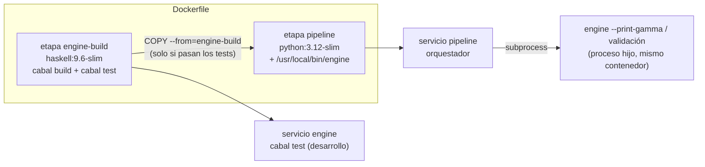

# Docker: cómo llega el engine al pipeline

El orquestador (Python) ejecuta el engine (Haskell) como **subproceso**, según el contrato CLI de [`contracts/README.md`](../contracts/README.md) §2. Para eso el binario tiene que estar dentro del contenedor `pipeline`. No hay comunicación entre contenedores.

## Decisión

Un solo [`Dockerfile`](../Dockerfile) con dos etapas. Cada servicio del compose elige la suya con `target`.

- **Etapa, imagen y servicio no son lo mismo.** `engine-build` es un paso de construcción; el servicio `engine` es el entorno donde se desarrolla y testea Haskell. El pipeline no le habla a ese contenedor: usa su propia copia del binario.
- **Sin `depends_on`.** `depends_on` ordena el arranque de contenedores, no las builds. La dependencia de build la resuelve `COPY --from`; con `depends_on`, cada corrida del pipeline levantaría también `cabal test` sin necesidad.
- **Tests antes de copiar.** Si `cabal test` falla, la imagen de `pipeline` no se construye. Un engine roto no falla ruidosamente: escribiría veredictos equivocados en los registros.
- **Imagen del pipeline liviana.** Lleva solo el binario (más `libgmp10`, que necesita en tiempo de ejecución), no GHC.

## Alternativas descartadas

- **Engine como servicio HTTP:** rompe la garantía de "sin red" del contrato y agrega dependencias de servidor.
- **`docker exec` desde el pipeline:** exige montar el socket de Docker, que da root sobre el host, en el contenedor que maneja salida del LLM.
- **Una sola imagen con GHC y Python:** imagen enorme, rebuilds acoplados y gates de los carriles mezclados.

## Cosas a tener en cuenta

- La primera build de `pipeline` compila el engine completo (varios minutos); después queda en caché.
- El binario dentro de `pipeline` es el de la última build, no el código montado en `./engine`. Tras cambiar el engine: `docker compose build pipeline`.
