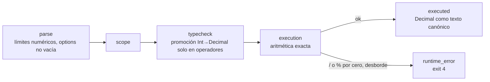

# Extensión del DSL: aritmética, Decimal, NOT, != e IN

Por qué y cómo se amplió el DSL. Reglas exactas: [`contracts/README.md`](../contracts/README.md) §1.

## Por qué

El DSL original solo comparaba y combinaba booleanos. Eso alcanzaba para "puntaje > 700 y sin morosidades", pero no para los dominios que el proyecto toma como modelo (crédito, exenciones impositivas, triaje) ni para las pruebas de decisión DMN en las que se inspira el corpus (sección 8 del documento del proyecto):

- **Montos y proporciones:** "la cuota no supera el 30 % del ingreso" necesita `*` y decimales. Veeramani et al. (2026) evalúan reglas fiscales con topes y porcentajes.
- **Negaciones y exclusiones:** "no tiene morosidades", "el plan no es Básico".
- **Pertenencia a un conjunto:** las tablas DMN comparan contra listas de valores ("tier en Gold o Platinum").

`specs/mission.md` pide no extender el DSL más allá de lo necesario. Cada agregado responde a una de esas necesidades; no se agregaron cadenas con operaciones, listas como valores, fechas ni `let`.

## Qué se agregó

| Agregado | Forma en el AST | Tipo |
|---|---|---|
| Aritmética | `BinaryOp` con `+ - * / %` | numérico; `/` siempre da `Decimal`; `%` solo entre `Int` |
| Decimal exacto | tipo base `Decimal`, literales numéricos | racional exacto en el engine |
| Negación | nodo `UnaryOp` con `NOT` | `Bool → Bool` |
| Desigualdad | `BinaryOp` con `!=` | como `==` |
| Pertenencia | nodo `In` con `value` y `options` | `τ` contra una lista de `τ` → `Bool` |

## Decisiones

- **Promoción Int → Decimal solo en operadores.** DMN, que el proyecto toma como modelo, tiene un único tipo numérico, y Python mezcla `int` y `Decimal` sin error. Con tipado estricto, `ingreso * 0.30` sería un error de tipos del DSL y no una alucinación del modelo: inflaría la tasa de intercepción del Tratamiento. Zhang et al. (2026) observan algo parecido en OCaml, donde parte de los errores de tipo son propios del lenguaje. En `App` y `Lam` no hay promoción: el núcleo STLC sigue estricto.
- **`/` devuelve siempre `Decimal`**, como `/` en Python 3: `7 / 2 = 3.5`. Una división entera silenciosa sería un error lógico difícil de ver.
- **Exacto y redondeo solo al final.** Los cálculos y comparaciones usan racionales exactos (`0.1 + 0.2 == 0.3`). El resultado se escribe como texto; si no termina (`10 / 3`), se redondea a 28 dígitos significativos *half-even*, igual que `decimal` de Python por defecto. Se evita el punto flotante porque rompe la igualdad exacta que exige una tarea determinística.
- **`AND` y `OR` cortocircuitan.** Así una guarda como `x != 0 AND 10 / x > 2` funciona igual que en Python. Sin cortocircuito, esa regla fallaría solo en el Tratamiento y sesgaría la comparación.
- **Primeros errores en ejecución.** Antes, un programa verificado nunca fallaba. Ahora puede dividir por cero o desbordar: son `runtime_error` legítimos (exit 4), distintos de un error interno del engine (exit 70). Esto hace comparable al Tratamiento con los baselines, donde `ZeroDivisionError` ya existía.
- **Límites numéricos.** `Int` es de 64 bits y `Decimal` tiene tope de 10^28 en valor y denominador. Con funciones de orden superior, un programa corto puede pedir cuentas de tamaño exponencial; los topes garantizan que el engine nunca agote la memoria.
- **`IN` sin tipo lista.** `options` es una lista escrita en el AST, no un valor: no hace falta un tipo `List τ`, ni en Γ ni en `Lam`.
- **Γ se deduce por valor:** un número no entero es `Decimal`, uno entero es `Int` (también `5000.0`). No depende de cómo lo serialice cada herramienta.

## Qué cambia en cada componente

- **`contracts/`:** esquema del AST, reglas de tipado, errores de ejecución, deducción de Γ, código de salida 4 y tipo `Decimal` en el resultado. Hay que avisar a los otros dos desarrolladores.
- **`engine/`:** tipos, parser, typechecker, evaluador y CLI.
- **`pipeline/`:**
  - el código de salida 4 en `run_engine`;
  - `Decimal` en el sandbox y en el `TypedDict` de Baseline 2;
  - valores `Decimal` exactos al leer y pasar `env`;
  - aclaraciones de semántica en los prompts.
- **Fixtures:** casos nuevos para cada construcción y para los errores en ejecución.

## Cosas a tener en cuenta

- Si una variable debe ser `Decimal` en todos los escenarios de una regla, sus valores tienen que ser no enteros. Si no, Γ cambia entre escenarios.
- `1 == 1.0` es `true`, pero el tipo del resultado sí cambia: `2 * 3` es `Int` y `2 * 3.0` es `Decimal`.
