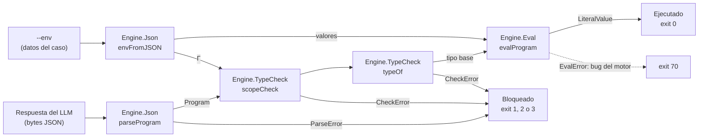

# Guía de conceptos de programación funcional

Este repositorio también sirve para aprender programación funcional con Haskell. Esta guía indica dónde está aplicado cada concepto del curso dentro del motor ([`engine/`](../engine/)) y qué conviene observar en cada lugar.

## Cómo buscar un concepto

Cada definición que ilustra un concepto lleva, justo encima, una etiqueta con la forma `FP[<concepto>]`:

```haskell
-- FP[Tipos algebraicos]
data CheckError
  = UnboundVariable Name
  ...
```

Para ver dónde se aplica un concepto, se busca su etiqueta exacta:

```powershell
git grep -nF "FP[Guardas]"
git grep -nF "FP["          # todas las etiquetas
```

Las etiquetas son la fuente de verdad sobre *dónde* está cada concepto. Esta guía explica *qué* mirar y por qué, y se refiere al código por nombre de función, no por número de línea.

## Dos lecturas del mismo código

El motor es un programa Haskell que verifica programas de otro lenguaje, el DSL STLC que emite el LLM. Por eso varios conceptos aparecen en dos niveles:

- **Haskell** es el lenguaje con el que está construido el motor. Ejemplos: los tipos algebraicos que modelan el AST, `Either` para los errores y las clases como `FromJSON`.
- **El DSL** es el lenguaje que el motor verifica, con su propio sistema de tipos (`Int`, `Bool`, `String`, `τ → τ`) y sus propias lambdas (`Lam`). Sus reglas están en [`contracts/README.md`](../contracts/README.md).

Cuando la tabla dice "DSL", el concepto es del lenguaje verificado. En los demás casos, es del Haskell del motor.

## Recorrido del motor



Cada flecha es una función pura que devuelve `Either`: un error es un valor más, nunca una excepción. `Engine.Cli.validate` encadena las etapas y `Engine.Cli.run` convierte el desenlace en el veredicto JSON y el código de salida del contrato; `Main` solo hace el IO alrededor de `run`.

## Mapa de conceptos

### Tipos

| Concepto | Etiqueta | Dónde | Qué observar | Test que lo muestra |
|---|---|---|---|---|
| Tipos | `FP[Tipos]` | `Engine.Types`: `Type`, `Name`, `Program`. `Engine.TypeCheck`: `typeOf` | Sinónimos (`type Name`), `newtype` y, en el DSL, la regla Γ ⊢ e : τ implementada en `typeOf` | `typeCheckSpec` |
| Inferencia de tipos | `FP[Inferencia de tipos]` | Funciones auxiliares sin firma: `classify` (en `parseProgram`), `rest` (en `validName`), `domain` (en `renderType`) | GHC deduce el tipo de lo que no tiene firma, igual que en `doble x = x + x`. Las funciones de nivel superior sí llevan firma: `-Wall` avisa si falta y la firma sirve de documentación. En el DSL no hay inferencia: los tipos de Γ salen de los datos y los parámetros de `Lam` vienen anotados | Todo el build: si una inferencia fallara, no compila |
| Tipos algebraicos | `FP[Tipos algebraicos]` | `Type`, `Expr`, `ParseError`, `CheckError` | Tipos suma (un constructor por caso) y recursivos (`Expr` contiene `Expr`); los errores también son un ADT | `jsonSpec`, `typeCheckSpec` |
| Clases | `FP[Clases]` | `deriving (Enum, Bounded)` de `BinOp`, instancias `FromJSON` | Instancias derivadas automáticamente y escritas a mano | `jsonSpec` |
| Polimorfismo | `FP[Polimorfismo]` | `Env a`, `scopeCheck`, `FromJSON BinOp` | Paramétrico: `Env a` sirve para tipos y para valores. Ad hoc: `minBound .. maxBound` según la clase `Bounded` | `envSpec` |

### Definiciones por casos

| Concepto | Etiqueta | Dónde | Qué observar | Test que lo muestra |
|---|---|---|---|---|
| Igualaciones | `FP[Igualaciones]` | `literalType`, `freeVars`, `typeOf` | Una ecuación por constructor ("igualación por tramos"): la función se lee como una lista de igualdades | `typeCheckSpec` |
| Patrones constantes | `FP[Patrones constantes]` | `opSymbol`, `applyOp`, `FromJSON Type`, `FromJSON Expr` | Ecuaciones que solo aplican a un valor fijo (`Eq`, `"Int"`, `"Literal"`), como `factorial 0 = 1` | "acepta todos los operadores binarios" |
| Patrones irrefutables | `FP[Patrones irrefutables]` | `isBase` | `_` y las variables nunca fallan: son el caso por defecto, como `esBinario _ = False`. El patrón perezoso `~(a, b)` todavía no se usa | `typeCheckSpec` ("NON_BASE_RESULT") |
| Guardas | `FP[Guardas]` | `lookupVar`, `entry` (en `envFromJSON`), `classify` (en `parseProgram`) | `\| condición = resultado`, evaluadas en orden; `otherwise` es simplemente `True` y va al final | `envSpec` |
| Condicionales | `FP[Condicionales]` | Haskell: `isBase` (patrones), `lookupVar` (Guardas), `fixtureParser` en los tests (`if`). DSL: caso `IfThenElse` de `typeOf` | Las tres formas de decidir que muestra el factorial. En Haskell y en el DSL, `if` exige que las dos ramas tengan el mismo tipo: `typeOf` implementa esa misma regla (`BRANCH_MISMATCH`) | "BRANCH_MISMATCH" |
| Funciones totales | `FP[Funciones totales]` | `lookupVar`, `validName`, `scopeCheck` | Toda entrada tiene respuesta: se devuelve `Maybe` o `Either` y se cubre el caso `[]`, en vez de usar `error` como en `myHead [] = error ...`. `-Wall` avisa si falta un caso, como el `[]` que le falta a un `myTake` | "rechaza valores y nombres..." |

### Listas y tuplas

| Concepto | Etiqueta | Dónde | Qué observar | Test que lo muestra |
|---|---|---|---|---|
| Patrones de listas | `FP[Patrones de listas]` | `lookupVar`, `validName`, `scopeCheck` | Desarmar listas: `[]` frente a `(x : xs)`, y `(v : _)` para quedarse con la cabeza | `envSpec` |
| Funciones de listas | `FP[Funciones de listas]` | `extend` (`:`), `freeVars` (`++`) | Armar listas: `:` agrega al frente en tiempo constante; `++` concatena y recorre la lista de la izquierda | `envSpec`, "scope" |
| `null` | `FP[null]` | `onlyKeys` | `null` dice si una lista está vacía. Se puede definir con patrones: `null [] = True; null _ = False` | "INVALID_AST ante formas..." (clave extra) |
| Listas por comprensión | `FP[Listas por comprensión]` | `freeVars`, `onlyKeys`, `FromJSON BinOp`, `fixturesSpec` | Filtrar y transformar en una sola expresión: `[v \| v <- freeVars b, v /= x]` | `typeCheckSpec` ("scope") |
| map, filter, fold | `FP[map/filter/fold]` | `names` (`map`), `freeVars` (`concatMap`), `validName` (`all`) | `all` es un fold; `concatMap` es map + concatenación | `envSpec` |
| Tuplas | `FP[Tuplas]` | `Env`, `lookupVar`, `envFromJSON` | El entorno es una lista de pares; `(k, v)` se desarma en el patrón y `(,) x` arma un par | `envSpec` |

### Funciones

| Concepto | Etiqueta | Dónde | Qué observar | Test que lo muestra |
|---|---|---|---|---|
| Recursión | `FP[Recursión]` | `renderType`, `lookupVar`, `freeVars`, `typeOf`, `eval`, `parseArgs` | Recursión estructural: cada llamada baja a un subárbol o a la cola, así que termina. `eval` es la excepción instructiva: en `App` evalúa el cuerpo de la clausura, que no es un subárbol del nodo; termina porque el DSL está tipado (STLC normaliza) | `typeCheckSpec`, `evalSpec` |
| Reducciones | `FP[Reducciones]` | `lookupVar` | Evaluar es reescribir usando las ecuaciones hasta llegar a un valor. Ver la traza más abajo | `envSpec` |
| Funciones puras | `FP[Funciones puras]` | `parseProgram`, `typeOf`, `checkProgram`, `eval`, `validate` | Sin IO ni excepciones: el resultado depende solo de los argumentos, y eso permite probarlas con QuickCheck. Incluso la CLI entera (`run`) es pura: los tests la llaman sin lanzar un proceso | Propiedades de `envSpec`, `typeCheckSpec` y `evalSpec`; `cliSpec` |
| Inmutabilidad | `FP[Inmutabilidad]` | `extend`, caso `Lam` de `typeOf`, `eval` | Agregar un binding crea un entorno nuevo; el anterior sigue intacto. Por eso una clausura puede guardar su entorno sin copiarlo | "un binding nuevo oculta al anterior...", "alcance léxico..." |
| Funciones anónimas | `FP[Funciones anónimas]` | Instancias `FromJSON` (`\o -> ...`), tests | Lambdas de Haskell pasadas como argumento sin nombrarlas | "INVALID_AST ante formas..." |
| Funciones lambda (DSL) | `FP[Funciones lambda]` | `Expr` (`Lam`, `App`), caso `Lam` de `typeOf`, `Value` (`VClosure`) | Una lambda del DSL tiene tipo `τ → σ`; su cuerpo se tipa con Γ extendido con el parámetro. Al evaluarse se convierte en una clausura: la lambda más el entorno donde se definió | "funciones de orden superior dentro del DSL", "alcance léxico..." |
| Funciones de orden superior | `FP[Orden superior]` | `parseProgram` (`either`), `envFromJSON` (`traverse`) | Funciones que reciben funciones. `traverse` aplica una función que puede fallar y corta en el primer error | "rechaza valores y nombres..." |
| Currificación | `FP[Currificación]` | Haskell: `typesOf` (`map (fmap literalType)`), `FromJSON Expr` (`BinaryOp <$> … <*> …`), `envFromJSON` (`(,) x`). DSL: caso `App` de `typeOf` y de `eval` | Toda función de Haskell recibe un argumento y devuelve otra función: `Env Type -> Expr -> Either CheckError Type` se lee `Env Type -> (Expr -> Either CheckError Type)`. Por eso se puede aplicar parcialmente: `typeOf emptyEnv` ya es una función lista para `map`, y un constructor se llena de a un campo con `<$>`/`<*>`. El DSL sigue la misma idea: `Lam` tiene un solo parámetro, así que una función de dos argumentos es una lambda que devuelve otra lambda, y `App twice notB` es una aplicación parcial de tipo `Bool → Bool` | "aplicación parcial en el DSL...", "el tipo de un literal es el de su valor" (`map (typeOf emptyEnv)`) |
| Composición | `FP[Composición]` | `parseProgram` (`Left . classify`), `evalProgram`, `validate`, `int` en los tests | `(.)` encadena funciones sin nombrar el argumento. `validate` encadena las etapas parse → typecheck → eval: cada una recibe lo que produjo la anterior | `jsonSpec`, `fixturesSpec` |
| Evaluación perezosa | `FP[Evaluación perezosa]` | `scopeCheck`, `run` | La lista de variables sin declarar solo se calcula hasta encontrar la primera, porque `case` solo mira la cabeza. Con `--print-gamma`, `run` nunca mira stdin, así que la lectura perezosa de `Main` nunca ocurre | "UNBOUND_VARIABLE con la primera variable...", "--print-gamma ... no lee stdin" |

## Reducción paso a paso

Igual que en la traza de `multiploRecursivo 2 5`, una llamada a `lookupVar` se evalúa reemplazando cada lado izquierdo por el lado derecho de la ecuación que coincide:

```haskell
lookupVar _ [] = Nothing
lookupVar x ((k, v) : rest)
  | x == k = Just v
  | otherwise = lookupVar x rest
```

```
lookupVar "x" [("y", TInt), ("x", TBool)]
= lookupVar "x" [("x", TBool)]     -- 2.ª ecuación, guarda otherwise ("x" /= "y")
= Just TBool                       -- 2.ª ecuación, guarda x == k ("x" == "x")
```

Cada paso es una igualdad válida, y por eso se puede razonar sobre el código como en álgebra. La misma idea aparece en el otro nivel, en el evaluador del DSL: la β-reducción `(λx. b) v ⇓ b` con `x ↦ v`. `eval` no sustituye texto; extiende el entorno de la clausura, que es equivalente y no requiere renombrar variables.

## Convenciones de nombres

- **camelCase** para funciones y variables (`lookupVar`, `checkProgram`); **PascalCase** para tipos y constructores (`CheckError`, `TArrow`).
- **Prima** (`f'`): por convención nombra una variante de `f`. El motor no la usa todavía.
- **`x : xs`**: en patrones de listas, el nombre en plural para la cola (`rest` en `lookupVar`).

## Pendientes

| Concepto | Dónde va a aparecer |
|---|---|
| Patrón perezoso `~(a, b)` | Todavía sin un uso natural en el motor |

## Cómo mantener esta guía

- Al escribir código que ilustra un concepto, agregar la etiqueta encima de la definición, con el nombre exacto de la tabla.
- Si es la primera vez que aparece ese concepto, pasarlo de "Pendientes" al mapa.
- Si una función se renombra o se borra, actualizar la fila correspondiente. `git grep -nF "FP["` muestra todas las etiquetas vigentes.
