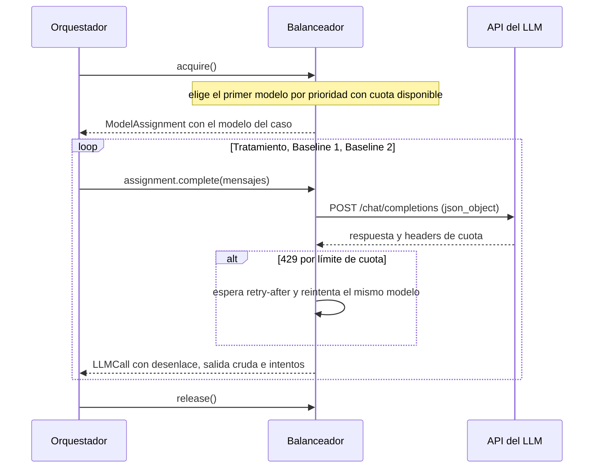

# Cliente LLM agnóstico

Cómo consume LLMs el pipeline y por qué. Reglas exactas para agentes: [`specs/llm-client.md`](../specs/llm-client.md).

## Idea

El código no sabe qué proveedor usa. Habla el protocolo de OpenAI (`/chat/completions`), que hoy exponen Groq, OpenAI, Ollama, vLLM, OpenRouter y también Anthropic y Gemini en modo compatible. Cambiar de proveedor, o pasar a un modelo local, es editar [`pipeline/llm.toml`](../pipeline/llm.toml) y poner la clave en `.env`.

## Flujo de un caso



## Decisiones y motivos

- **Un solo protocolo, sin SDKs.** Cubre todos los casos que necesitamos con cero dependencias (`urllib` de la stdlib).
- **Modelo fijo por caso.** Los tres grupos de un mismo caso usan el mismo modelo, para que la comparación Tratamiento/B1/B2 no mezcle modelos. El modelo usado se registra en cada caso.
- **Balanceo entre modelos gratuitos de Groq.** Groq limita por tokens y requests. El balanceador lee los headers de cuota después de cada respuesta y manda los casos nuevos al primer modelo con margen, en orden de prioridad. Si Groq responde 429, espera y reintenta el mismo modelo; si la espera es demasiado larga (por ejemplo, porque se agotó la cuota diaria), registra el caso como `quota_exhausted`.
- **Chequeo al arrancar.** Consulta `GET /models` y descarta los modelos que no existen o cuya clave es inválida.
- **JSON en los tres grupos.** Todas las llamadas usan `json_object`, así que el modo de salida es el mismo en todos los grupos. Los baselines devuelven `{"code": "..."}`.
- **Sin reparar la salida.** Solo se reintentan los fallos de transporte (red, 5xx, 429). Si el modelo genera JSON inválido, eso es un resultado y se registra con la salida cruda.

## Uso

```powershell
Copy-Item .env.example .env   # completar GROQ_API_KEY
docker compose run --rm pipeline sh -c "mypy . && pytest"
```

```python
from pipeline.llm import build_balancer, load_config

balancer = build_balancer(load_config())
with balancer.acquire() as assignment:
    call = assignment.complete([{"role": "user", "content": "... respondé en JSON ..."}])
```

## Pendiente

- Acordar el bloque `llm` del registro de salida (propuesta en la spec).
- Calibrar `reserve_tokens` con el consumo real y definir los parámetros de muestreo (`params`) del experimento.
