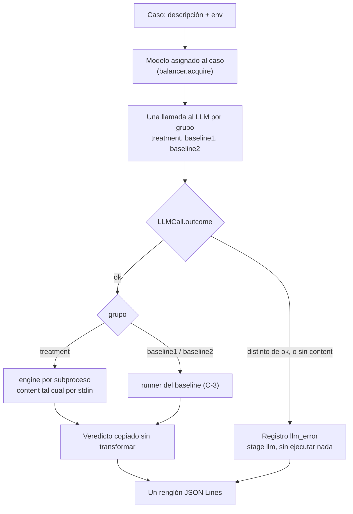

# Orquestador: triple llamada, ruteo y registro

Cómo procesa un caso [`pipeline/pipeline/orchestrator.py`](../pipeline/pipeline/orchestrator.py). Contratos en [`contracts/README.md`](../contracts/README.md).

## Flujo de un caso

## Decisiones

- **Tres llamadas, un modelo.** Cada grupo recibe su propio prompt y su propia llamada, pero las tres usan el mismo `ModelAssignment`, así la comparación no mezcla modelos.
- **El ruteo lo decide el `outcome`.** Solo una llamada `ok` con `content` llega a un runner. Cualquier otra falla del LLM se registra como `llm_error` con `error.code` igual al `outcome` (`quota_exhausted`, `transport_error`, etc.), o `missing_content` si el 2xx no trajo texto.
- **Sin reparar la salida.** El `content` del LLM se guarda en `llm_raw` y se pasa tal cual al runner; el engine es la única frontera de parseo del Tratamiento.
- **Runners intercambiables.** Cada grupo tiene un runner `(llm_raw, env, gamma) -> veredicto`: `run_treatment`, `run_baseline_1` y `run_baseline_2`. Γ viaja a todos porque Baseline 2 lo necesita para tipar `data`; los otros dos lo ignoran.
- **Registro append-only.** `append_jsonl` agrega renglones sin reescribir lo ya registrado, así una corrida cortada conserva los casos terminados.
- **Errores del engine.** Exit 70 se registra como `runtime_error` (`ENGINE_INTERNAL`) y un timeout como `timeout`; exit 64 o un veredicto que no coincide con su código de salida abortan la corrida, porque son bugs del sistema, no resultados.
- **"Triple llamada" es una llamada por grupo**, no tres repeticiones de cada grupo. El registro de salida no tiene campo para numerar repeticiones; si hicieran falta, habría que cambiar el contrato.

## Pendiente

- Los códigos `missing_content` y `TIMEOUT`, y el uso del desenlace de la llamada como código de error, son convenciones del orquestador que todavía no figuran en [`contracts/README.md`](../contracts/README.md).
- Los prompts de `build_messages` son provisorios. Influyen en el experimento, así que el equipo tiene que revisarlos.
- Los tres runners existen; falta conectarlos en el comando de punta a punta.
- Falta el comando que corre todos los casos de punta a punta (roadmap, Día 5).

Reglas exactas para agentes: [`specs/orquestador.md`](../specs/orquestador.md).
