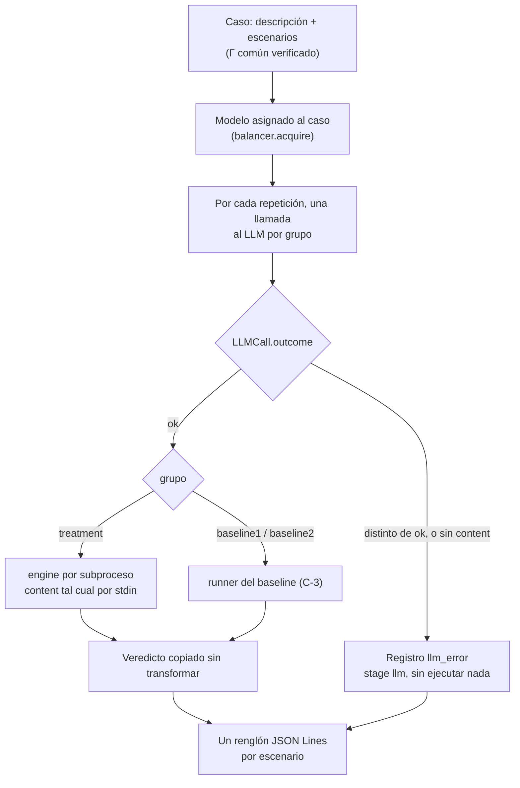

# Orquestador: triple llamada, ruteo y registro

Cómo procesa un caso [`pipeline/pipeline/orchestrator.py`](../pipeline/pipeline/orchestrator.py). Contratos en [`contracts/README.md`](../contracts/README.md).

## Flujo de un caso

## Decisiones

- **Tres llamadas, un modelo.** Cada grupo recibe su propio prompt y su propia llamada, pero las tres usan el mismo `ModelAssignment`, así la comparación no mezcla modelos.
- **El ruteo lo decide el `outcome`.** Solo una llamada `ok` con `content` llega a un runner. Cualquier otra falla del LLM se registra como `llm_error` con `error.code` igual al `outcome` (`quota_exhausted`, `transport_error`, etc.), o `missing_content` si el 2xx no trajo texto.
- **Sin reparar la salida.** El `content` del LLM se guarda en `llm_raw` y se pasa tal cual al runner; el engine es la única frontera de parseo del Tratamiento.
- **Una generación, varios escenarios.** Para `pass@1`, la misma respuesta del LLM se ejecuta contra todos los escenarios de su regla, al estilo de las pruebas DMN. Se escribe un renglón por escenario, así cada resultado se cruza directo con su `expected`. Los bloqueos no dependen del escenario, así que se repiten iguales en todos. Una generación se identifica por `(run_id, case_id, group, repetition)`.
- **Repeticiones.** `run_case` puede hacer varias rondas por caso, como Zhang (5) o Goossens (3), todas con el mismo modelo.
- **Γ común.** Antes de llamar al LLM se verifica que Γ sea el mismo en todos los escenarios. Si no, es un error del corpus y la corrida se aborta.
- **Runners intercambiables.** Cada grupo tiene un runner que recibe la respuesta del LLM, los `env` de todos los escenarios y Γ, y devuelve un veredicto con su duración por escenario. Tratamiento y Baseline 1 ejecutan escenario por escenario (`per_scenario`). Baseline 2 hace el análisis estático una sola vez por generación y después ejecuta cada escenario. Γ viaja a todos porque Baseline 2 lo necesita para tipar `data`.
- **Registro append-only.** `append_jsonl` agrega renglones sin reescribir lo ya registrado, así una corrida cortada conserva los casos terminados.
- **Errores del engine.** Exit 70 se registra como `runtime_error` (`ENGINE_INTERNAL`) y un timeout como `timeout`; exit 64 o un veredicto que no coincide con su código de salida abortan la corrida, porque son bugs del sistema, no resultados.
- **"Triple llamada" es una llamada por grupo**, no tres repeticiones de cada grupo. Las repeticiones son otra cosa: rondas completas de triple llamada, numeradas en `repetition`.

## Pendiente

- Los códigos `missing_content` y `TIMEOUT`, y el uso del desenlace de la llamada como código de error, son convenciones del orquestador que todavía no figuran en [`contracts/README.md`](../contracts/README.md).
- Los prompts de `build_messages` son provisorios. Influyen en el experimento, así que el equipo tiene que revisarlos.
- El comando de punta a punta es `python -m pipeline run` (ver `specs/orquestador.md`). Por defecto corre las fixtures con una repetición y escribe `out/<run_id>.jsonl`.

Reglas exactas para agentes: [`specs/orquestador.md`](../specs/orquestador.md).
