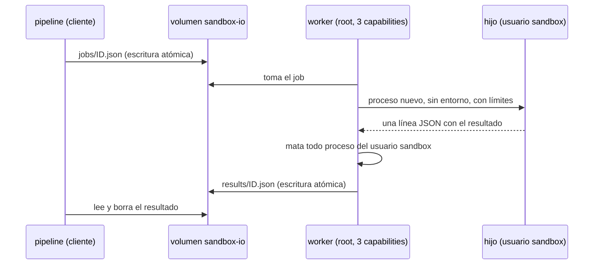

# Sandbox de los baselines

Dónde y cómo se ejecuta el código Python que genera el LLM para Baseline 1 y 2. Código: [`sandbox.py`](../pipeline/pipeline/baselines/sandbox.py) (cliente) y [`sandbox_worker.py`](../pipeline/pipeline/baselines/sandbox_worker.py) (worker). Reglas exactas para agentes: [`specs/sandbox.md`](../specs/sandbox.md).

## Decisión

El código del LLM no se ejecuta nunca en el contenedor `pipeline`, que tiene red y las claves del `.env`. Se ejecuta en un contenedor aparte, `sandbox`, con `network_mode: none`. Como no hay red, la única vía de comunicación es un volumen compartido que funciona como cola de archivos.

Solo la ejecución va al sandbox. El análisis estático de Baseline 2 (`ast`, `mypy`) no ejecuta el código y corre en `pipeline`.

## Capas de aislamiento

- **Contenedor:** sin red, sin `.env`, sin volúmenes del repo, sistema de archivos de solo lectura, `cap_drop: ALL` salvo `SETUID`, `SETGID` y `KILL`, `no-new-privileges`, y límites de memoria (512 MB), CPU (1) y procesos (64).
- **Proceso hijo:** usuario `sandbox` (uid 10001), entorno vacío, `python -I -S`, sin ningún directorio escribible, sin acceso a la cola (`/io` es `0700` de root), y límites propios: 256 MB de memoria, 16 procesos, CPU igual al timeout y 1 MB de salida.
- **Entre casos:** un proceso nuevo por job y, al terminar, se matan todos los procesos del usuario `sandbox`. Con `init: true`, tini corre como PID 1 y recoge los procesos huérfanos, así que no quedan zombies. Lo que deja un caso no llega al siguiente.
- **Salida:** lo que imprime el código del LLM va a `/dev/null`. El resultado sale por un descriptor aparte, así que un `print` no puede disfrazarse de resultado.

## Protocolo

- **Job:** `{"code", "env", "function", "timeout"}`. El hijo ejecuta `function(env)`; por defecto, `evaluate_rule`.
- **Resultado:** `status` es uno de:
  - `ok`, con `type` (`Int`, `Bool`, `String` u `Other`) y `value` (con `repr` si es `Other`);
  - `exception`, con `name` y `message`;
  - `timeout`;
  - `crash`, si el hijo murió sin dejar resultado.

  El mapeo a `outcome`, `stage` y `error` del registro lo hace cada baseline.
- Si el worker no responde dentro de `timeout` + 30 s, el cliente lanza `SandboxError` y la corrida se aborta: es una falla del sistema, no un resultado.

## Por qué sin red

No es solo porque lo diga la especificación. Hay cuatro motivos:

- **El código no es confiable.** Nadie revisa lo que genera el LLM antes de ejecutarlo. Con red, podría descargar y ejecutar otra cosa o sacar datos.
- **Las claves.** `pipeline` carga `.env` completo. Si el código corriera ahí, podría leer `GROQ_API_KEY` y mandarla afuera.
- **Determinismo.** El experimento compara qué tan determinísticos son los grupos. Un resultado que depende de la red no es reproducible.
- **Comparación justa.** El engine corre sin red por contrato. Si los baselines pudieran más, la comparación quedaría sesgada.

Para reglas de negocio simples, que el modelo genere código de red es poco probable. Pero el experimento corre muchos casos sin supervisión, justamente para medir las alucinaciones del modelo.

## Alternativas y por qué se eligió esta

Se evaluaron tres formas de conectar `pipeline` con un contenedor aislado:

- **A. Contenedor por ejecución** (`docker run --network none`). Descartada: exige montar el socket de Docker en `pipeline`, y eso da control del host. Además, arrancar un contenedor por caso distorsiona `duration_ms`.
- **B. Contenedor sin red con cola de archivos.** Elegida.
- **C. Servicio HTTP en una red interna** (`internal: true`). Descartada por seguridad.

B es menos vulnerable que C porque en B la falta de red es estructural: el contenedor solo tiene la interfaz de loopback. En C, el aislamiento depende de la configuración. Estos riesgos los tiene C y B no:

- si alguien quita `internal: true` o agrega el servicio a otra red, el código vuelve a tener internet, y nada falla que lo avise;
- el DNS interno de Docker podría reenviar consultas hacia afuera, que sirven para sacar datos; habría que verificarlo;
- el código ve a los demás servicios de esa red;
- hay un servidor HTTP expuesto al código del LLM.

Lo que cuesta B es más código propio (la cola, su revisión y la limpieza) y un canal de escritura en el volumen. Ese canal se mitiga con los permisos de `/io`, descritos en las capas de arriba.

El riesgo más importante es común a las dos opciones: el código comparte el contenedor con el worker. Por eso el hijo corre con otro usuario, sin permisos de escritura y con límites propios.

## Cosas a tener en cuenta

- `docker compose run pipeline` levanta `sandbox` por `depends_on`. Con `docker compose up`, el worker queda corriendo después de los gates: cortalo con Ctrl+C o `docker compose down`.
- `sandbox_worker.py` se copia a la imagen: después de cambiarlo, `docker compose build sandbox`.
- Los tests de [`test_sandbox.py`](../pipeline/tests/test_sandbox.py) usan el sandbox real y se saltean fuera de Compose.

## Pendiente (etapa 2 en adelante)

Estas decisiones siguen abiertas. Las propuestas están en [`specs/sandbox.md`](../specs/sandbox.md):

- quién extrae `code` de la respuesta y cómo se registra una respuesta ilegible;
- el timeout de ejecución (propuesta: 5 s);
- cómo se traduce cada `status` del sandbox al registro;
- el tipo de `data` en la firma tipada que exige Baseline 2.
