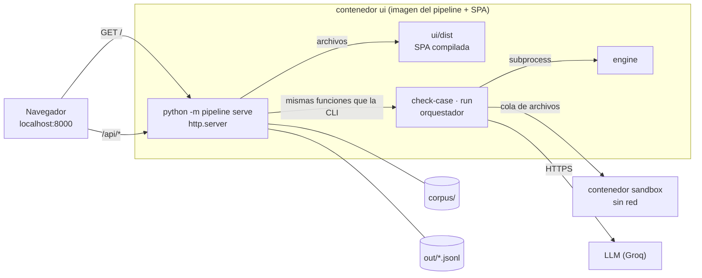
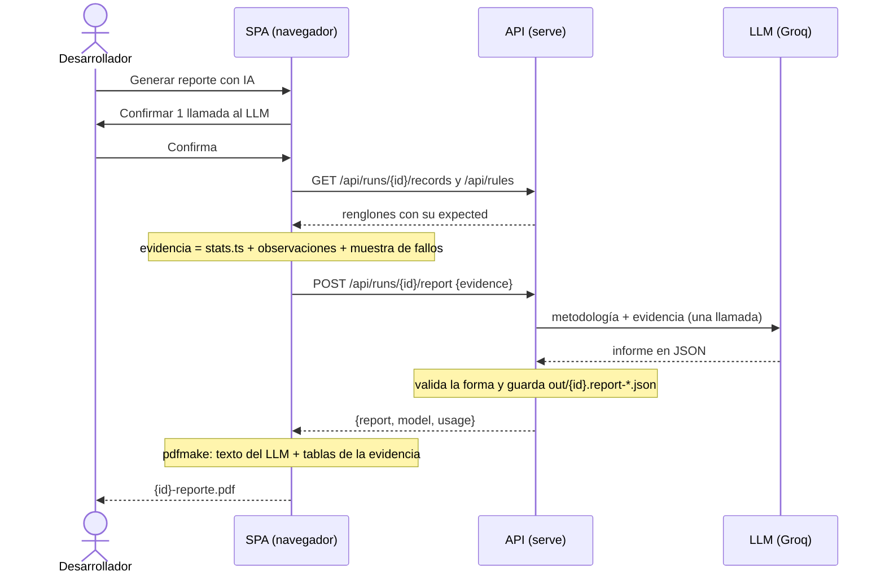

# UI del pipeline

Una aplicación web local para hacer desde el navegador lo que hoy se hace con la CLI: armar y revisar el corpus, correr el pipeline y mirar los registros. Se agregó después del MVP, cuando el equipo decidió extender el alcance del repo a una UI (2026-09-26). Reglas para agentes: [`specs/ui.md`](../specs/ui.md).

```powershell
docker compose up --build ui
# abrir http://localhost:8000
```

## Qué se puede hacer

- **Corpus:** buscar y filtrar reglas; crear, editar y eliminar. El panel de edición tiene las pestañas General, Variables y escenarios, AST (con vista legible), Python y Revisión (estado y comentarios). Al guardar se corre `check-case`: los `expected` que faltan los calcula el engine y los errores se muestran en el panel. "Verificar todas" revisa el corpus entero sin escribir.
- **Corridas:** elegir el corpus completo, algunas reglas o las fixtures, y las repeticiones. La UI muestra cuántas llamadas al LLM va a hacer la corrida y pide confirmar ese número antes de lanzarla. Mientras corre, se ve el log y se puede cancelar. Cada corrida del listado se puede exportar a JSONL, TXT, MD, CSV, Excel o PDF; todos salvo el JSONL incluyen el `expected` de cada escenario. "Generar reporte con IA" descarga un informe en PDF de la corrida (ver más abajo).
- **Registros:** elegir una corrida y filtrar por regla, grupo, desenlace o modelo. Cada renglón muestra el resultado junto a su `expected`, y al abrirlo, la respuesta cruda del LLM.
- **Estadísticas:** el resumen de una corrida, desde la sección o con "Ver estadísticas" en el listado de Corridas: `pass@1` por grupo, desenlaces por grupo, el desglose por regla, categoría y dominio, la duración y los códigos de error.

Si una regla la escribe un script de `corpus/tools/`, el editor lo avisa: el cambio hay que llevarlo también al script, o se pierde la próxima vez que se corra. Cuando dos personas editan la misma regla, la segunda en guardar recibe un aviso en lugar de pisar el cambio de la primera.

## Arquitectura



- **Un solo proceso sirve la SPA y la API.** No hace falta CORS, ni un segundo contenedor, ni un proxy.
- **La API vive en la imagen del pipeline.** Así usa el mismo engine, el mismo cliente del LLM y la misma cola del sandbox que la CLI. Una acción desde la UI da el mismo resultado que desde la terminal.
- **API con la biblioteca estándar.** `http.server` alcanza para una API local de pocas rutas, y el pipeline no suma dependencias.
- **La SPA se compila en Docker.** La etapa `ui-build` corre `tsc`, los tests de vitest y `vite build`, y solo si pasan copia `dist/` a la imagen. Es la misma regla que el engine: un build roto no llega al servicio.

## Seguridad

- El puerto se publica solo en `127.0.0.1`: el contenedor tiene la clave del LLM y la API no tiene login.
- La API nunca devuelve la clave. `/api/health` informa si hay credenciales y qué modelos se usan; si falta la variable, muestra su nombre, no su valor.
- El código que genera el LLM se sigue ejecutando solo en el sandbox.

## Desarrollo

- `ui/` es React + Vite + TypeScript + Tailwind. Node se usa solo dentro de Docker: no hace falta instalarlo.
- Los colores son tokens del prototipo aprobado ("Mesa de revisión del corpus") definidos en `ui/src/index.css`, con tema claro y oscuro según el sistema.
- Para agregar una dependencia: `npm install` en un contenedor `node:22-alpine` sobre una copia de `ui/`, y copiar de vuelta solo `package.json` y `package-lock.json` (ver `specs/ui.md`).

## Etapas

| Etapa | Qué agrega | Estado |
|---|---|---|
| 1. Base | Servidor, `GET /api/health`, navegación y barra de estado | hecha |
| 2. Corpus | Crear, editar y eliminar reglas de `corpus/`, con `check-case` al guardar | hecha |
| 3. Corridas y registros | Lanzar `run` con confirmación de cuota, log en vivo, cancelar y explorar los registros | hecha |
| 4. Estadísticas | Resumen de una corrida calculado en el navegador | hecha |
| 5. Reporte con IA | Informe en PDF de una corrida redactado por el LLM | hecha |

## Cómo se cuentan las estadísticas

Se decidió el 2026-10-07 que la UI resuma una corrida. El cálculo se hace en el navegador con los mismos registros que muestra Registros: el pipeline y la API siguen sin agregar nada, y el análisis del experimento sigue siendo aparte ([`specs/mission.md`](../specs/mission.md) §2).

- Una **generación** es una respuesta del LLM: una regla, un grupo, una repetición. Tiene un renglón por escenario.
- Una generación **pasa** si en todos sus escenarios ejecutó y el resultado es igual al `expected`, con el mismo tipo (`5` entero no es igual a `5` decimal).
- Si algún escenario no tiene `expected` (por ejemplo, las fixtures), la generación no cuenta para `pass@1`.
- **`pass@1`** de un grupo: generaciones que pasan sobre generaciones con `expected`.

## Reporte con IA

Se decidió el 2026-10-07: cada corrida del listado tiene "Generar reporte con IA", que descarga un informe en PDF con la lectura de la corrida según las bases metodológicas del proyecto (el informe de la segunda entrega, resumido en [`pipeline/pipeline/report_methodology.md`](../pipeline/pipeline/report_methodology.md)).



- **Las cifras las calcula la SPA, no el LLM.** Las tablas del anexo salen de la misma evidencia que se le manda al modelo, con las funciones de Estadísticas. El texto del LLM las comenta; el prompt le prohíbe usar cifras que no estén en la evidencia.
- **El informe contrasta las ocho observaciones metodológicas** de la corrida preliminar (modo JSON del proveedor, formato de los baselines, preámbulo del Baseline 2, balance de modelos, categoría 2, bloqueos en `parse`, repeticiones, consistencia de los `expected`) y dice si se repiten.
- **Queda la traza.** Cada llamada guarda en `out/` la evidencia enviada y la respuesta cruda del modelo, para poder revisar de dónde salió cada frase.
- **Consume cuota**, como una corrida: por eso pide confirmación.
