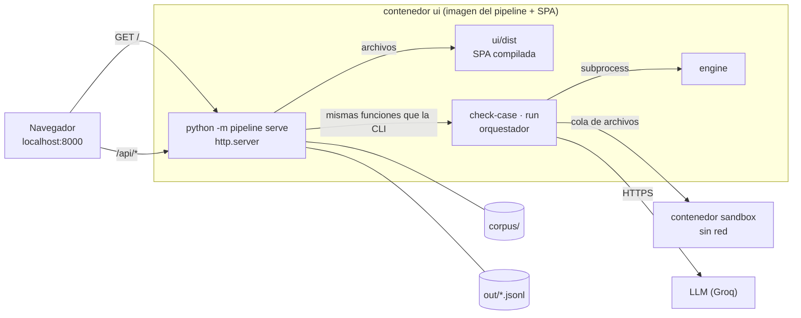

# UI del pipeline

Una aplicación web local para hacer desde el navegador lo que hoy se hace con la CLI: armar y revisar el corpus, correr el pipeline y mirar los registros. Se agregó después del MVP, cuando el equipo decidió extender el alcance del repo a una UI (2026-09-26). Reglas para agentes: [`specs/ui.md`](../specs/ui.md).

```powershell
docker compose up --build ui
# abrir http://localhost:8000
```

## Arquitectura



- **Un solo proceso sirve la SPA y la API.** No hace falta CORS, ni un segundo contenedor, ni un proxy.
- **La API vive en la imagen del pipeline.** Así usa el mismo engine, el mismo cliente del LLM y la misma cola del sandbox que la CLI. Una acción desde la UI da el mismo resultado que desde la terminal.
- **API con la biblioteca estándar.** `http.server` alcanza para una API local de pocas rutas, y el pipeline no suma dependencias.
- **La SPA se compila en Docker.** La etapa `ui-build` corre `tsc`, los tests de vitest y `vite build`, y solo si pasan copia `dist/` a la imagen. Es la misma regla que el engine: un build roto no llega al servicio.

## Seguridad

- El puerto se publica solo en `127.0.0.1`: el contenedor tiene la clave del LLM y la API no tiene login.
- La API nunca devuelve la clave. `/api/health` informa si hay credenciales y qué modelos se usan; si falta la variable, muestra su nombre, no su valor.
- El código que genera el LLM se sigue ejecutando solo en el sandbox.

## Desarrollo

- `ui/` es React + Vite + TypeScript + Tailwind. Node se usa solo dentro de Docker: no hace falta instalarlo.
- Los colores son tokens del prototipo aprobado ("Mesa de revisión del corpus") definidos en `ui/src/index.css`, con tema claro y oscuro según el sistema.
- Para agregar una dependencia: `npm install` en un contenedor `node:22-alpine` sobre una copia de `ui/`, y copiar de vuelta solo `package.json` y `package-lock.json` (ver `specs/ui.md`).

## Etapas

| Etapa | Qué agrega | Estado |
|---|---|---|
| 1. Base | Servidor, `GET /api/health`, navegación y barra de estado | hecha |
| 2. Corpus | Crear, editar y eliminar reglas de `corpus/`, con `check-case` al guardar | pendiente |
| 3. Corridas y registros | Lanzar `run` con confirmación de cuota, log en vivo, cancelar y explorar los registros | pendiente |

La UI no calcula métricas: mostrar un registro al lado de su `expected` sí, contar `pass@1` por grupo no. Eso sigue siendo trabajo del experimento ([`specs/mission.md`](../specs/mission.md) §2).
